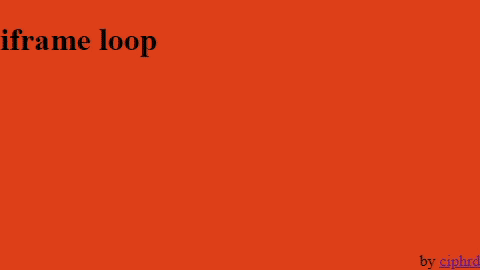

Iframe feedback
========



The concept of iframe feedback is very simple: a web document which shows an iframe with an url pointing to itself. If a script handles when the iframe is inserted in the document, the script can decide the delay between two *frames* (I mean the thing is called an i**frame**, at some point this had to be done). The rendering logic to blend the frames is up to each case.

> more infos about the iframe feedback [on my blog](https://ciphrd.com/2021/02/10/iframe-feedback-a-fun-technique-with-iframes-on-the-web/)


## What does this "iframe feedback" boilerplate does

* provides a dev environment out-of-the-box (you just launch it with a command and you can expriment with a local server)
* has already a clean starting point with the iframe insertion, as well as a solution to get a frame index using the location of the document

So basically, you follow the installation steps below, and you can play in the `app/index.js` file.


## Some stuff you may want to know

* The html entry point is `index.ejs`. It get turned in time into html code, you don't have to worry about that

## Requirements
You only need <b>node.js</b> `>=10.13.0` pre-installed and you’re good to go. 


## Installation
Clone this repo
```sh
$ git clone https://github.com/bcrespy/iframe-feedback.git your_folder
```
Remove the link between your folder and this repo
```sh
$ cd your_folder
$ rm -rf .git
```
Install dependencies
```sh
$ npm install
```


## Development
Build the app in dev mode and run webpack serve with livereload and autocompile on [http://localhost:8080/](http://localhost:8080/)
```sh
$ npm run dev
```

Go to [http://localhost:8080](http://localhost:8080)


## Production
If you want to put your work online, run the following command and host the generated files in `/dist` (a static files server will do the job).
```sh
$ npm run build
```